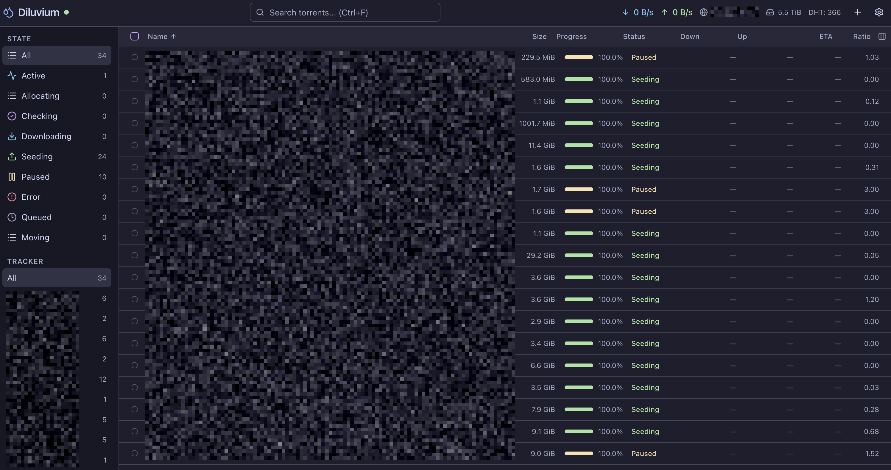

# Diluvium

A modern web UI for the [Deluge](https://deluge-torrent.org/) BitTorrent client. Built with React, TypeScript, and Tailwind CSS.



## Features

- Real-time torrent monitoring with 3s polling
- Add torrents via file upload, magnet links, or URLs
- Drag & drop `.torrent` files
- Per-torrent file priority editing
- Speed graphs (download/upload history)
- NFO generator with multiple templates
- Torrent creator via Deluge RPC
- Column visibility customization
- Resizable detail panel
- Shift+click / Ctrl+A multi-selection
- Country flags for peers
- Multiple themes: Light, Dark, System, Catppuccin (Mocha/Latte), Nord (Dark/Light)
- Keyboard shortcuts (A=add, N=nfo, Space=pause/resume, Del=remove, Ctrl+F=search)

## Prerequisites

- [Node.js](https://nodejs.org/) 20+
- [pnpm](https://pnpm.io/) 9+
- A running [Deluge](https://deluge-torrent.org/) daemon with web UI enabled

## Quick Start

```bash
# Clone and install
git clone <repo-url> diluvium
cd diluvium
pnpm install

# Configure the Deluge URL (defaults to http://localhost:8112)
cp .env.example .env
# Edit .env to point DELUGE_URL to your Deluge web interface

# Start development server
pnpm dev
```

Open http://localhost:5173 and log in with your Deluge web password.

## Build for Production

```bash
pnpm build
```

The output is in `dist/`. Use the provided Docker image (recommended) or place the `dist/` folder behind a reverse proxy that forwards `/json` and `/upload` to your Deluge instance — Deluge does not send CORS headers, so a direct browser-to-Deluge setup will not work.

## Docker

The Docker image uses nginx to both serve the UI and proxy API calls to Deluge. This avoids CORS entirely — the browser always talks to the same origin (the nginx container), which forwards `/json` and `/upload` requests to your Deluge instance.

### Quick start

```bash
docker run -p 3000:80 -e DELUGE_URL=http://192.168.1.x:8112 ghcr.io/you/diluvium
```

Or build and run locally:

```bash
docker build -t diluvium .
docker run -p 3000:80 -e DELUGE_URL=http://192.168.1.x:8112 diluvium
```

### Docker Compose

Edit `docker-compose.yml` and set `DELUGE_URL` to your Deluge address, then:

```bash
docker compose up -d
```

Diluvium will be available at http://localhost:3000.

> **No rebuild needed** — `DELUGE_URL` is read at container startup. Just update the env var and restart.

## Environment Variables

| Variable | Description |
|----------|-------------|
| `DELUGE_URL` | Deluge web UI address, e.g. `http://192.168.1.100:8112`. Used by Vite proxy in dev and by nginx in Docker. |

## Project Structure

```
src/
  api/           # Deluge JSON-RPC client, React Query hooks, types
  components/
    layout/      # App shell, header, sidebar
    settings/    # Settings dialog
    torrents/    # Torrent table, detail panel, add/remove dialogs, NFO
    ui/          # Reusable UI primitives (button, dialog, tabs, etc.)
  lib/           # Utilities, theme store, NFO templates
  pages/         # Login + Dashboard pages
```

## Security

- All API calls use `credentials: "include"` (cookie-based auth from Deluge)
- 30s request timeout prevents hung connections
- Production builds have source maps disabled
- No secrets stored in the frontend — authentication is handled by Deluge's session cookies
- Passwords are cleared from React state immediately after login attempt
- File download names are sanitized

## License

MIT
